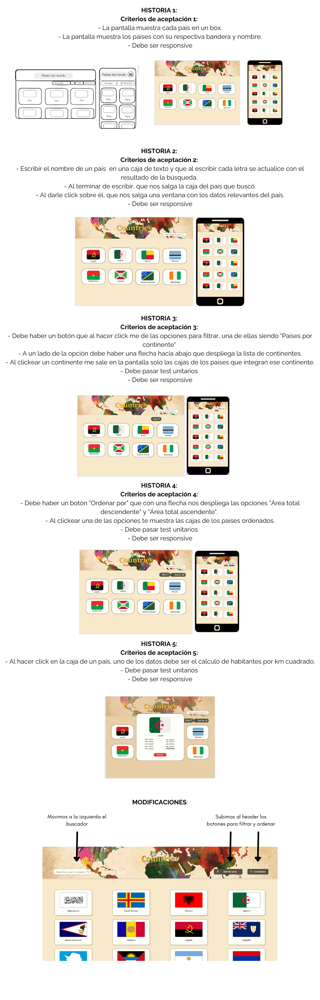

¡Exploremos los paises del mundo! 

PLANIFICACIÓN:

En este proyecto Data Lovers decidimos crear una aplicación del tema Countries.

Para iniciar en la planificación respondimos las siguientes preguntas:

• ¿Quiénes son los principales usuarios de producto?

R: Estudiantes

• ¿Cuáles son los objetivos de estos usuarios en relación con el producto?

R: Obtener datos interesantes sobre los países del mundo.

• ¿Cuáles son los datos más relevantes que quieren ver en la interfaz y por qué?

R:  Su nombre común y oficial.

    Su Top Level Domain (tld), la extensión que utilizan en internet, por ejemplo la de Perú es .pe y la de Brasil es .br.

    Si se ha independizado o no.

    Su(s) Capital(es).

    La subregión a la que pertenece.

    Los lenguajes hablados en ese país.

    Los países con los que limita.

    Su área total (en metros cuadrados).

    Un emoji con su respectiva bandera.

    La población total.

    Su coeficiente de gini (del año más reciente del cual se tenga data).

    La nomenclatura utilizada por la FIFA para identificar al país.

    Su huso horario.

    El continente al cual pertenece.

    Y por último, imágenes y descripción de su bandera.

• ¿Cuándo utilizan o utilizarían el producto?

R: Cuando quieran investigar o conocer más sobre algún país.

Seguido a la investigación, planteamos las historias de usuario y los prototipos de baja fidelidad (realizado en Excalidraw), el cual fue planteado como idea inicial general de como se vería la página y fue modificado al empezar a realizar los prototipos de alta fidelidad (elaborados en Canva > https://www.canva.com/design/DAFpjyXCLnk/qZWEVp9DSP8LwkUtCYNtWQ/edit) y a medida que se iba construyendo el producto, como se muestra a continuación:

DESCRIPCIÓN DEL PRODUCTO:

Nuestra propuesta permite que el usuario (estudiante) entre a la página desde una pc, tablet o smartphone,    visualice en un principio todos los países del mundo ordenados alfabéticamente, navegue hacia abajo y vuelva hacia arriba con una barra lateral, o bien utilizando un botón para regresar rápidamente al inicio de las tarjetas, así mismo haga click a cualquier pais de su interés y se le abra una ventana con la información completa del país seleccionado, incluyendo el cálculo de población por km².

Por otra parte cuenta con un buscador en el que puede ingresar el nombre de un país y le muestra el resultado de su búsqueda en tiempo real a medida que ingresa los caracteres. 

Adicionalmente el header contiene dos botones. El primero llamado Continents para filtrar los paises según su continente, al seleccionar una opción, la pantalla le muestra los paises que se encuentran en dicho continente manteniendo el orden alfabético. El botón Sort By Area permite ordenar la data según su tamaño de área, de más grande a más pequeño y a la inversa. Estos filtros funcionan en conjunto. 

Al hacer click al título en el header, el usuario regresa a la página inicial. 

Cuando el usuario recorre la página, el header se mantiene mostrando el buscador y los botones de interés.

El producto final ofrece una solución ideal para el estudiante que desee investigar o conocer más sobre los paises del mundo, permitiéndole obtener información relevante y ordenada de su interés.

PRINCIPALES PROBLEMAS ENCONTRADOS EN LOS TESTS:

Según lo solicitado, nos planteamos testear la función de filtrar por el buscador, filtrar según continentes, ordenar paises según área y función qu calcula la densidad de la población. El principal problema que tuvimos fue que por error empezamos a testear una función que no correspondía con lo que estabamos probando y no teníamos bien formulada la condición. Este problema fue resuelto con una ayudantía.

